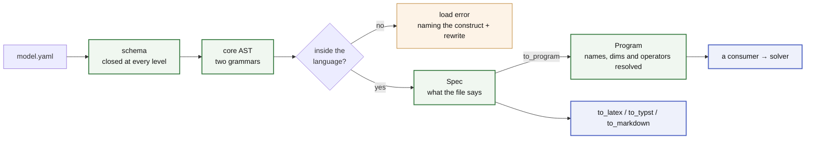

<!--
SPDX-FileCopyrightText: math-spec contributors
SPDX-License-Identifier: CC-BY-4.0
-->

# math-spec

<!--- --8<-- [start:badges] -->

[](https://github.com/energy-models/math-spec/actions/workflows/ci.yml)
[](https://prefix.dev/channels/conda-forge/packages/math-spec)
[](https://pypi.org/project/math-spec)
[](https://pypi.org/project/math-spec)
[](https://math-spec.readthedocs.io)

<!--- --8<-- [end:badges] -->

**The language an optimisation model is written in — and the math it means.**

One YAML file declares the axes a model runs over, the data it expects, the
decisions a solver makes, and the rules those decisions obey. math-spec is that
language: a schema closed at every level, two small grammars, every check that
can be run before a single number is bound — and a typesetter that prints the
file as the math it stands for.

It builds nothing and it solves nothing. What it hands a consumer is a checked
AST and one rule per question, so that an engine, a renderer and a checker
reading the same file cannot disagree about what it says. Whether two consumers
answering a question separately would be a bug is the whole
[test](docs/about/what-counts-as-language.md) for whether that question belongs
here at all.

Three properties follow from that, and each is a page:

- **Nothing is guessed.** Everything decidable without data is decided without
  data — every expression, every `where` string, every _uncalled_ macro
  template is parsed and name-checked at load. Where a file does not determine
  the answer, loading fails and the message names the rewrite
  ([errors and limits](docs/reference/language/errors.md)).
- **The language is finite, and the ceiling is argued rather than drawn.** A
  primitive is admissible if it is relational and local; everything else is a
  macro, or an `escape:` island that is visible in the file and billed before it
  runs ([the ceiling](docs/about/ceiling.md)).
- **The file is the document.** A model prints as LaTeX, Typst or Markdown from
  the file alone — no data, no solver, no second source of truth
  ([typeset](docs/reference/typeset.md)).

<!--- --8<-- [start:flow] -->



<!--- --8<-- [end:flow] -->

## Example

<!--- --8<-- [start:model] -->

```yaml title="dispatch.yaml"
description: Least-cost dispatch of a generator fleet against an hourly load.

dimensions:
  snapshot: { dtype: int, description: dispatch periods }
  generator: { description: generating units }

parameters:
  p_max: { dims: [generator], description: installed capacity }
  load: { dims: [snapshot], description: demand to be met }
  cost: { dims: [generator], description: marginal cost }

variables:
  p:
    description: output of a generator in a snapshot
    foreach: [snapshot, generator]
    where: "p_max > 0"
    bounds: { lower: 0, upper: p_max }

constraints:
  power_balance:
    foreach: [snapshot]
    expression: sum(p, over=generator) == load

objective:
  sense: minimize
  expression: sum(p * cost)
```

<!--- --8<-- [end:model] -->

That file is a complete model. Nothing outside it changes what it means, and
everything about it that can be wrong is wrong at load:

<!--- --8<-- [start:load] -->

```python
import math_spec as ms

spec = ms.to_spec('dispatch.yaml')  # schema, names, dims, degree — all checked here
sorted(spec.variables)  # ['p']

program = ms.to_program(spec)  # curves expanded, names typed, operators resolved to nodes
program.constraints[0].name  # 'power_balance'
```

Neither needs data or a solver: a repository of models can be compiled in CI
with nothing bound to any of them. The two states are the whole seam — **`Spec`
is what the file says, `Program` is what it means** — and a consumer that
builds reads the second.

<!--- --8<-- [end:load] -->

That seam is [one page](docs/reference/language/reading.md), and it is the whole
of it.

And the same file says, in print:

```python
symbols = 'dispatch.symbols.yaml'  # optional: a dict, a path, or a SymbolTable

ms.to_latex('dispatch.yaml', symbols=symbols)  # amsmath align
ms.to_typst('dispatch.yaml')  # compiles without a TeX toolchain
ms.to_markdown('dispatch.yaml')  # renders as-is on GitHub
```

Drop the symbol table and the same model prints as $\mathit{load}_t$,
$p^{\mathrm{max}}_g$ — unambiguous rather than beautiful, and with no setup at
all. Every spelling in a table is printed verbatim, a key naming nothing in the
model is an error rather than a symbol that silently never applies, and nothing
in a table changes what the file means.

Or from a shell, where this belongs in a Makefile next to `pdflatex`:

```bash
python -m math_spec latex dispatch.yaml --symbols dispatch.symbols.yaml --standalone -o dispatch.tex
python -m math_spec typst dispatch.yaml --standalone -o dispatch.typ
python -m math_spec markdown dispatch.yaml
```

## Why

- **Declarative math** — readable without knowing any implementation, and
  self-contained: no Python state changes what a file means. It diffs cleanly in
  review and travels as a research artefact.
- **Fail early, fail loud** — nothing falls back silently, and an error names
  the problem _and_ its rewrite. A model that does not compile does not print
  either: typesetting runs the same load-time checks everything else does.
- **One flat namespace, ten rules** — a collision is a load error naming both
  declarations, position decides which kinds of name are legal, and a name's
  kind is fixed at load. The [ten rules](docs/reference/language/index.md) are
  one principle in ten positions.
- **A closed operator set** — `sum`, `at`, `shift`, and the arithmetic and
  `where` grammars. Compositions go in `macros:`, which cost nothing at build
  and cannot diverge between consumers.
- **A finite language with a priced way out** — the ceiling is a closure
  (relational ∩ local), not a feature race; genuinely unsayable math goes in an
  `escape:` island, visible in the file and billed before it runs.

## Docs

Start with [**the language**](https://math-spec.readthedocs.io/latest/reference/language/) —
the ten rules, and eight pages that are the exact ones. Then
[every construct as math](https://math-spec.readthedocs.io/latest/reference/notation/),
which prints all of it beside the notation the typesetter gives it, and
[typeset the math](https://math-spec.readthedocs.io/latest/reference/typeset/)
for how to print your own. Why the language is shaped this way — what may enter
it, and who owns a rule once it is in — is under
[about](https://math-spec.readthedocs.io/latest/about/ceiling/). To work on it,
[CONTRIBUTING.md](CONTRIBUTING.md).

## Installation

This project is managed by [pixi](https://pixi.prefix.dev/). To develop against
it:

<!--- --8<-- [start:docs-install-dev] -->

```bash
git clone https://github.com/energy-models/math-spec
cd math-spec

pixi run pre-commit-install
pixi run test
```

<!--- --8<-- [end:docs-install-dev] -->

Releases are on the alpha stream and **nothing is published yet** — the publish
job is off until the project leaves it, so `pip install math-spec` is what the
first release will look like, not what today does. Install from a checkout or a
git reference until then; see [RELEASING.md](RELEASING.md).

## Prior art

Every file under `src/` was written in
[lpspec](https://github.com/fluxopt/lpspec) and extracted here so that the
language, and the AST a consumer reads it through, are a dependency rather than
one engine's internals. The surface — YAML math, a block per component,
`foreach:`, a `where:` string — comes from
[Calliope](https://github.com/calliope-project/calliope);
[linopy](https://github.com/PyPSA/linopy) supplies the shared vocabulary that
`sum(over=)` and the dim algebra are named against. Issue numbers in these pages
point at lpspec, which is where the arguments happened.

## Status

Alpha, pre-1.0.

<!--- --8<-- [start:status] -->

**Breaking changes land without a deprecation cycle.** When a construct is named
wrong, a default is wrong, or a permissive input turns out to hide a silent
wrong answer, it gets fixed rather than aliased — carrying a compatibility shim
for every earlier spelling would defeat the point of a small language.

In practice: pin an exact version if you depend on this, and read the
[changelog](https://github.com/energy-models/math-spec/blob/main/CHANGELOG.md)
before upgrading. What exists is tested — every construct the language has
round-trips through the schema, the parsers and all three typeset formats, and
the LaTeX is compiled rather than eyeballed. It is the _surface_ that is not yet
frozen, not the behaviour.

<!--- --8<-- [end:status] -->

## Licence

The code is [MIT](LICENSE) — everything under `src/`, `tests/`, `tools/`, the
examples, and the generated schema.

The prose is [CC-BY-4.0](LICENSES/CC-BY-4.0.txt) — everything under `docs/`, this
README, `CHANGELOG.md`, and the logos in `resources/`. Reuse it freely, with
attribution.
