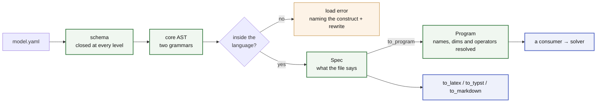

<!--
SPDX-FileCopyrightText: math-spec contributors
SPDX-License-Identifier: CC-BY-4.0
-->

# math-spec

<!--- --8<-- [start:badges] -->

[](https://github.com/energy-models/math-spec/actions/workflows/ci.yml)
[](https://prefix.dev/channels/conda-forge/packages/math-spec)
[](https://pypi.org/project/math-spec)
[](https://pypi.org/project/math-spec)
[](https://math-spec.readthedocs.io)

<!--- --8<-- [end:badges] -->

**The language an optimisation model is written in — and the math it means.**

One YAML file declares the dimensions a model runs over, the data it expects,
the decisions a solver makes and the rules those decisions obey. math-spec is
that language, and the typesetter that prints a file as the math it stands for.
It is a schema closed at every level, two small grammars, and every check that
runs before a number is bound.

It builds nothing and solves nothing. It hands a consumer a checked AST and one
rule per question, so an engine, a renderer and a checker reading the same file
cannot disagree about what it says. A question belongs here iff two consumers
answering it separately would be a bug
([what counts as language](docs/about/what-counts-as-language.md)).

<!--- --8<-- [start:flow] -->



<!--- --8<-- [end:flow] -->

## Example

<!--- --8<-- [start:model] -->

```yaml title="dispatch.yaml"
description: Least-cost dispatch of a generator fleet against an hourly load.

dimensions:
  snapshot: { dtype: int, description: dispatch periods }
  generator: { description: generating units }

parameters:
  p_max: { dims: [generator], description: installed capacity }
  load: { dims: [snapshot], description: demand to be met }
  cost: { dims: [generator], description: marginal cost }

variables:
  p:
    description: output of a generator in a snapshot
    foreach: [snapshot, generator]
    where: "p_max > 0"
    bounds: { lower: 0, upper: p_max }

constraints:
  power_balance:
    foreach: [snapshot]
    expression: sum(p, over=generator) == load

objective:
  sense: minimize
  expression: sum(p * cost)
```

<!--- --8<-- [end:model] -->

That file is a complete model. Nothing outside it changes what it means, and
everything about it that can be wrong is wrong at load:

<!--- --8<-- [start:load] -->

```python
import math_spec as ms

spec = ms.to_spec('dispatch.yaml')  # schema, names, dims, degree — all checked here
sorted(spec.variables)  # ['p']

program = ms.to_program(spec)  # curves expanded, names typed, operators resolved to nodes
sorted(program.constraints)  # ['power_balance']
```

Neither needs data or a solver, so a repository of models compiles in CI with
nothing bound to any of them. **`Spec` is what the file says, and `Program` is
what it means.** A consumer that builds reads the second.

<!--- --8<-- [end:load] -->

[Reading a loaded model](docs/reference/language/reading.md) is the whole of
that seam.

The same `spec` prints three ways:

```python
symbols = 'dispatch.symbols.yaml'  # optional: a dict, a path, or a SymbolTable

ms.to_latex(spec, symbols=symbols)  # amsmath align
ms.to_typst(spec)  # compiles without a TeX toolchain
ms.to_markdown(spec)  # renders as-is on GitHub
```

Without a symbol table the same model prints as $\mathit{load}_t$,
$p^{\mathrm{max}}_g$. A table changes the spelling and nothing else: every
spelling in it is printed verbatim, and a key naming nothing in the model is an
error.

Or from a shell:

```bash
python -m math_spec latex dispatch.yaml --symbols dispatch.symbols.yaml --standalone -o dispatch.tex
python -m math_spec typst dispatch.yaml --standalone -o dispatch.typ
python -m math_spec markdown dispatch.yaml
```

## Why

- **Declarative math.** A file is readable without knowing any implementation,
  and no Python state changes what it means. It diffs cleanly in review and
  travels as a research artefact.
- **Nothing is guessed.** Everything decidable without data is decided at load:
  every expression, every `where` string, every _uncalled_ macro template.
  Where a file does not determine the answer, loading fails and the message
  names the construct and its rewrite
  ([reading a loaded model](docs/reference/language/reading.md#what-the-loader-refuses)). A model that does
  not load does not print either.
- **One flat namespace, ten rules.** A collision is a load error naming both
  declarations, position decides which kinds of name are legal, and a name's
  kind is fixed at load. The [ten rules](docs/reference/language/index.md) are
  one principle in ten positions.
- **A closed operator set.** `sum`, `at`, `shift`, and the arithmetic and
  `where` grammars. Compositions go in `macros:`, which cost nothing at build
  and cannot diverge between consumers.
- **A finite language with a priced way out.** The ceiling is a closure,
  relational ∩ local: a primitive is admissible if it is both. Everything else
  is a macro, or an `escape:` island that is visible in the file and billed
  before it runs ([the ceiling](docs/about/ceiling.md)).
- **The file is the document.** A model prints as LaTeX, Typst or Markdown
  from the file alone: no data, no solver, no second source of truth
  ([typeset](docs/reference/typeset.md)).

## Docs

Start with [**the language**](https://math-spec.readthedocs.io/latest/reference/language/):
the ten rules, and the pages that state them exactly.
[Every construct as math](https://math-spec.readthedocs.io/latest/reference/notation/)
prints all of it beside the notation the typesetter gives it, and
[typeset the math](https://math-spec.readthedocs.io/latest/reference/typeset/)
says how to print your own. Why the language is shaped this way is under
[about](https://math-spec.readthedocs.io/latest/about/ceiling/). To work on it,
read [CONTRIBUTING.md](CONTRIBUTING.md).

## Installation

The project is managed by [pixi](https://pixi.prefix.dev/). To develop against
it:

<!--- --8<-- [start:docs-install-dev] -->

```bash
git clone https://github.com/energy-models/math-spec
cd math-spec

pixi run pre-commit-install
pixi run test
```

<!--- --8<-- [end:docs-install-dev] -->

**Nothing is published yet.** The publish job is off while the project is on
the alpha stream ([RELEASING.md](RELEASING.md)). Until it leaves it, install
from a checkout or a git reference; `pip install math-spec` is what the first
release will look like.

## Prior art

The code was extracted from [lpspec](https://github.com/fluxopt/lpspec), so
that the language and the AST a consumer reads it through are a dependency
rather than one engine's internals. Issue numbers in these pages point at
lpspec. The surface (YAML math, a block per component, `foreach:`, a `where:`
string) comes from [Calliope](https://github.com/calliope-project/calliope).
[linopy](https://github.com/PyPSA/linopy) supplies the vocabulary that
`sum(over=)` and the dimension algebra are named against.

## Status

Alpha, pre-1.0.

<!--- --8<-- [start:status] -->

**Breaking changes land without a deprecation cycle.** A construct named wrong,
a default that is wrong, or a permissive input that hides a silent wrong answer
is fixed rather than aliased. Pin an exact version if you depend on this, and
read the
[changelog](https://github.com/energy-models/math-spec/blob/main/CHANGELOG.md)
before upgrading.

The surface is not frozen; the behaviour is tested. Every construct round-trips
through the schema, the parsers and all three typeset formats, and the LaTeX is
compiled rather than eyeballed.

<!--- --8<-- [end:status] -->

## Licence

The code is [MIT](LICENSE): everything under `src/`, `tests/`, `tools/`, the
examples, and the generated schema.

The prose is [CC-BY-4.0](LICENSES/CC-BY-4.0.txt): everything under `docs/`,
this README, `CHANGELOG.md`, and the logos in `resources/`.
