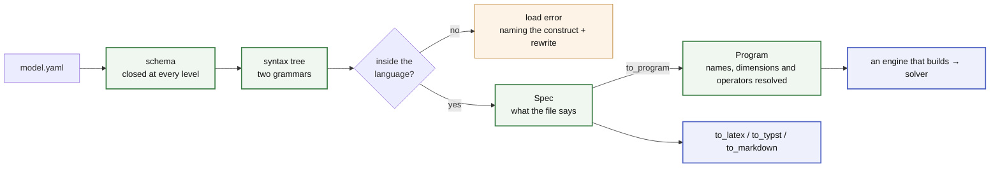

<!--
SPDX-FileCopyrightText: math-spec contributors
SPDX-License-Identifier: CC-BY-4.0
-->

# math-spec

<!--- --8<-- [start:badges] -->

[](https://github.com/energy-models/math-spec/actions/workflows/ci.yml)
[](https://prefix.dev/channels/conda-forge/packages/math-spec)
[](https://pypi.org/project/math-spec)
[](https://pypi.org/project/math-spec)
[](https://math-spec.readthedocs.io)

<!--- --8<-- [end:badges] -->

**Write an optimisation model as a YAML file. Check it and print it as math,
with no data and no solver.**

A math-spec file declares four things: the axes the model runs over, such as
`snapshot` and `generator`; the data it expects, such as `load` and `cost`; the
decisions the solver makes, such as `dispatch`; and the rules those decisions obey, such
as `sum(dispatch, over=generator) == load`. The file [below](#example) is a complete
model.

math-spec reads that file, checks everything that can be checked without data,
and hands the result on: to an engine that builds and solves the model, or to the
typesetter that prints it as LaTeX, Typst or Markdown. It builds nothing and
solves nothing itself. Every tool reads the file through the same checked syntax
tree, so an engine and a renderer cannot disagree about what the file means; that
is the [test](docs/about/what-counts-as-language.md) for what belongs here.

Three properties follow:

- **Nothing is guessed.** A misspelled name, a `where` string on an undeclared
  parameter, a constraint whose dimensions do not match its `foreach`: each fails
  when the file loads, with a message that names the fix. A repository of models
  checks in CI with no data ([errors](docs/reference/language/errors.md)).
- **The operators are a fixed set.** `sum`, `sum_back`, `at` and `shift`. A file
  cannot add one, so a model never depends on what one engine registered. A
  composition of them goes in `macros:` ([the limits](docs/about/limits.md)).
- **The file is the document.** `to_latex(spec)` prints the model as equations
  from the file alone, so the math you publish is the math you solve
  ([typeset](docs/reference/typeset.md)).

<!--- --8<-- [start:flow] -->



<!--- --8<-- [end:flow] -->

## Example

<!--- --8<-- [start:model] -->

```yaml title="dispatch.yaml"
description: Least-cost dispatch of a generator fleet against an hourly load.

dimensions:
  snapshot: { dtype: int, description: dispatch periods }
  generator: { description: generating units }

parameters:
  capacity: { dims: [generator], description: installed capacity }
  load: { dims: [snapshot], description: demand to be met }
  cost: { dims: [generator], description: marginal cost }

variables:
  dispatch:
    description: output of a generator in a snapshot
    foreach: [snapshot, generator]
    where: "capacity > 0"
    bounds: { lower: 0, upper: capacity }

constraints:
  power_balance:
    foreach: [snapshot]
    expression: sum(dispatch, over=generator) == load

objective:
  sense: minimize
  expression: sum(dispatch * cost)
```

<!--- --8<-- [end:model] -->

That file is a complete model. Nothing outside it changes what it means, and
everything about it that can be wrong is wrong at load:

<!--- --8<-- [start:load] -->

```python
import math_spec as ms

spec = ms.to_spec('dispatch.yaml')  # schema, names, dims, degree — all checked here
sorted(spec.variables)  # ['dispatch']

program = ms.to_program(spec)  # curves expanded, names typed, operators resolved to nodes
sorted(program.constraints)  # ['power_balance']
```

Neither needs data or a solver, so a repository of models compiles in CI with
nothing bound to any of them. **A `Spec` holds the file as written, and a
`Program` holds the model it builds**, with every macro expanded and every curve
turned into its variables and constraints. An engine reads the second.

<!--- --8<-- [end:load] -->

[Reading a loaded model](docs/reference/language/reading.md) says what a tool
gets from each.

The same `spec` prints as math. It is read and checked once, then printed three
ways:

```python
symbols = 'dispatch.symbols.yaml'  # optional: a dict, a path, or a SymbolTable

ms.to_latex(spec, symbols=symbols)  # amsmath align
ms.to_typst(spec)  # compiles without a TeX toolchain
ms.to_markdown(spec)  # renders as-is on GitHub
```

Drop the symbol table, and the same model prints as $\mathit{load}_t$ and
$dispatch^{\mathrm{max}}_g$, with no setup. Every spelling in a table is printed as
written, a key naming nothing in the model is an error, and nothing in a table
changes what the file means.

Or from a shell, beside `pdflatex` in a Makefile:

```bash
python -m math_spec latex dispatch.yaml --symbols dispatch.symbols.yaml --standalone -o dispatch.tex
python -m math_spec typst dispatch.yaml --standalone -o dispatch.typ
python -m math_spec markdown dispatch.yaml
```

## Why

- **Declarative math.** A file is readable without knowing any implementation,
  and no Python state changes what it means. It diffs in review and travels as a
  research artefact.
- **Fail early, fail loud.** Nothing falls back silently, and an error names the
  problem and its rewrite. A model that does not load does not print either.
- **One flat namespace, ten rules.** A collision is a load error naming both
  declarations, position decides which kinds of name are legal, and a name's kind
  is fixed at load. The [ten rules](docs/reference/language/index.md) are one
  principle in ten positions.
- **A closed operator set.** `sum`, `sum_back`, `at` and `shift`, with the
  arithmetic and `where` grammars. A composition of them goes in `macros:`, so
  every engine expands it the same way.
- **A finite language.** An operator joins the language only if each output row
  reads a bounded number of input rows, and a file cannot add one. Math the
  language cannot express is refused, with the rewrite named.

## Docs

Start with [the language](https://math-spec.readthedocs.io/latest/reference/language/):
the ten rules, and the pages that give the exact ones. Then
[every construct as math](https://math-spec.readthedocs.io/latest/reference/notation/),
which prints all of it beside the notation the typesetter gives it, and
[typeset the math](https://math-spec.readthedocs.io/latest/reference/typeset/)
for how to print your own. Why the language is shaped this way, what may enter
it, and who owns a rule once it is in are under
[about](https://math-spec.readthedocs.io/latest/about/limits/). To work on it,
read [CONTRIBUTING.md](CONTRIBUTING.md).

## Installation

This project is managed by [pixi](https://pixi.prefix.dev/). To develop against
it:

<!--- --8<-- [start:docs-install-dev] -->

```bash
git clone https://github.com/energy-models/math-spec
cd math-spec

pixi run pre-commit-install
pixi run test
```

<!--- --8<-- [end:docs-install-dev] -->

Releases are on the alpha stream, and **nothing is published yet**. The publish
job is off until the project leaves it, so `pip install math-spec` is what the
first release will look like, not what today does. Install from a checkout or a
git reference until then; see [RELEASING.md](RELEASING.md).

## Prior art

Every file under `src/` was written in [lpspec](https://github.com/fluxopt/lpspec)
and extracted here, so that the language and the syntax tree a tool reads it
through are a dependency rather than one engine's internals. The keys themselves,
which are YAML math, a block per component, `foreach:` and a `where:` string,
come from [Calliope](https://github.com/calliope-project/calliope).
[linopy](https://github.com/PyPSA/linopy) supplies the vocabulary that
`sum(over=)` and the dimension rules are named against. Issue numbers in these
pages point at lpspec, where the arguments happened.

## Status

Alpha, pre-1.0.

<!--- --8<-- [start:status] -->

**Breaking changes land without a deprecation cycle.** When a construct is named
wrong, a default is wrong, or a permissive input hides a silent wrong answer, it
is fixed rather than aliased. A compatibility shim for every earlier spelling
would defeat the point of a small language.

Pin an exact version if you depend on this, and read the
[changelog](https://github.com/energy-models/math-spec/blob/main/CHANGELOG.md)
before upgrading. What exists is tested: every construct the language has
round-trips through the schema, the parsers and all three typeset formats, and
the LaTeX is compiled rather than eyeballed. It is the accepted YAML that is not
yet frozen, not the behaviour.

<!--- --8<-- [end:status] -->

## Licence

The code is [MIT](LICENSE): everything under `src/`, `tests/`, `tools/`, the
examples, and the generated schema.

The prose is [CC-BY-4.0](LICENSES/CC-BY-4.0.txt): everything under `docs/`, this
README, `CHANGELOG.md`, and the logos in `resources/`. Reuse it freely, with
attribution.
