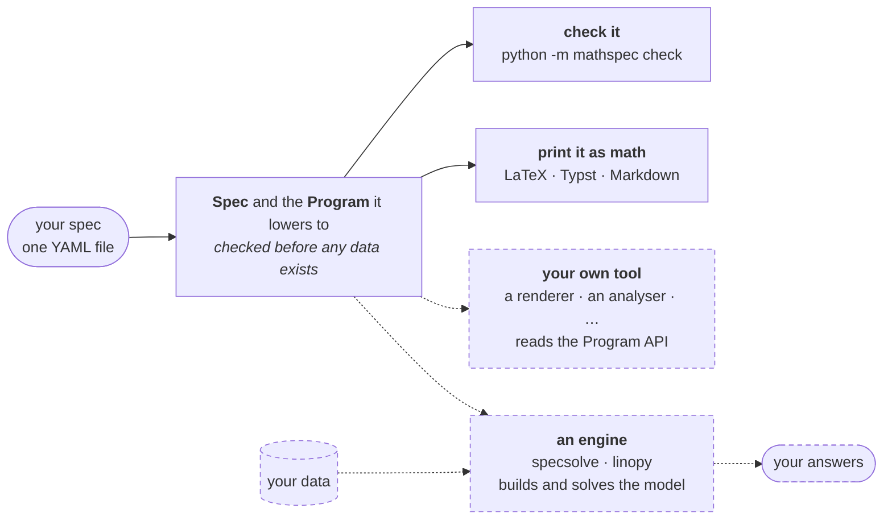

<!--
SPDX-FileCopyrightText: mathspec contributors
SPDX-License-Identifier: CC-BY-4.0
-->

# mathspec

<!--- --8<-- [start:badges] -->

[](https://github.com/energy-models/mathspec/actions/workflows/ci.yml)
[](https://prefix.dev/channels/conda-forge/packages/mathspec)
[](https://pypi.org/project/mathspec)
[](https://pypi.org/project/mathspec)
[](https://mathspec.readthedocs.io)

<!--- --8<-- [end:badges] -->

**Write the specification (spec) of an optimisation model as a YAML file. Check it and print it
as math, with no data and no solver.**

A mathspec file states a specification, or spec. A spec declares four things: the axes it runs
over, such as `snapshot` and `generator`; the data it expects, such as `load`
and `cost`; the decisions the solver makes, such as `dispatch`; and the rules
those decisions obey, such as `sum(dispatch, over=generator) == load`. The file
[below](#example) is a complete spec.

<!--- --8<-- [start:engines] -->

mathspec builds nothing and solves nothing itself.
[specsolve](https://github.com/fluxopt/specsolve) and
[linopy](https://github.com/PyPSA/linopy) build a model from a spec and its
data, and solve it. Support in both is work in progress. Any other tool can
read the same spec through the
[Program API](https://mathspec.readthedocs.io/en/latest/reference/program/).
The solid boxes are mathspec; the dashed boxes are outside it.



<!--- --8<-- [end:engines] -->

<!--- --8<-- [start:benefits] -->

- **Check specs in CI, with no data.** A wrong name or
  dimension fails when the file loads, and the error names the fix.
  [Errors →](https://mathspec.readthedocs.io/en/latest/reference/language/errors/)
- **Publish the math you solve.** The equations in the paper
  print from the file the solver reads.
  [Typeset →](https://mathspec.readthedocs.io/en/latest/reference/typeset/)
- **One spec, many tools.** Engines, renderers and analysers read the spec
  through one public API, so no two of them can read the file differently.
  [Program API →](https://mathspec.readthedocs.io/en/latest/reference/program/)
- **Write full-size specs.** The spec of PyPSA's `n.optimize()` model is
  one file, with stochastic, multi-period and quadratic variants.
  [PyPSA in one file →](https://mathspec.readthedocs.io/en/latest/examples/pypsa/)

<!--- --8<-- [end:benefits] -->

## Example

<!--- --8<-- [start:model] -->

```yaml title="dispatch.yaml"
description: Least-cost dispatch of a generator fleet against an hourly load.

dimensions:
  snapshot: { dtype: int, description: dispatch periods }
  generator: { description: generating units }

parameters:
  capacity: { dims: [generator], description: installed capacity }
  load: { dims: [snapshot], description: demand to be met }
  cost: { dims: [generator], description: marginal cost }

variables:
  dispatch:
    description: output of a generator in a snapshot
    dims: [snapshot, generator]
    where: "capacity > 0"
    bounds: { lower: 0, upper: capacity }

constraints:
  power_balance:
    dims: [snapshot]
    expression: sum(dispatch, over=generator) == load

objective:
  sense: minimize
  expression: sum(dispatch * cost)
```

<!--- --8<-- [end:model] -->

### The math it prints

The typesetter prints the file above as math, with no data and no solver.
Markdown is one of three formats, and GitHub renders it here.

<!-- Prettier pads the legend tables that the generator emits unpadded, so the
     two would rewrite each other forever. The range keeps this file formatted
     and the block below byte-for-byte what the typesetter printed. -->
<!-- prettier-ignore-start -->
<!-- readme-math:begin -->

Least-cost dispatch of a generator fleet against an hourly load.

#### Objective

```math
\min \sum_{t \in \mathcal{T},\ g \in \mathcal{G}} \mathit{dispatch}_{t,g} \cdot \mathrm{cost}_{g}
```

#### Subject to

**`power_balance`**

```math
\sum_{g \in \mathcal{G}} \mathit{dispatch}_{t,g} = \mathrm{load}_{t} \qquad \forall\, t \in \mathcal{T}
```

#### Variable domains

**`dispatch`**

```math
0 \le \mathit{dispatch}_{t,g} \le \mathrm{capacity}_{g} \qquad \forall\, t \in \mathcal{T},\ g \in \mathcal{G} \,:\, \mathrm{capacity}_{g} > 0
```

<details>
<summary>The whole document: a symbol table, and the legend it prints</summary>

Least-cost dispatch of a generator fleet against an hourly load.

#### Sets

| Symbol | Meaning |
|---|---|
| $`\mathcal{S}`$ | index $`s`$ — `snapshot` — dispatch periods |
| $`\mathcal{G}`$ | index $`g`$ — `generator` — generating units |

#### Parameters

| Symbol | Meaning |
|---|---|
| $`\bar p`$ | `capacity` over $`\mathcal{G}`$ — installed capacity |
| $`\ell`$ | `load` over $`\mathcal{S}`$ — demand to be met |
| $`c`$ | `cost` over $`\mathcal{G}`$ — marginal cost |

#### Variables

| Symbol | Meaning |
|---|---|
| $`\mathit{dispatch}`$ | `dispatch` over $`\mathcal{S} \times \mathcal{G}`$ — output of a generator in a snapshot |

#### Objective

$`\min \sum_{s \in \mathcal{S},\ g \in \mathcal{G}} \mathit{dispatch}_{s,g} \cdot c_{g}`$

#### Subject to

**`power_balance`**

$`\sum_{g \in \mathcal{G}} \mathit{dispatch}_{s,g} = \ell_{s} \qquad \forall\, s \in \mathcal{S}`$

#### Variable domains

**`dispatch`**

$`0 \le \mathit{dispatch}_{s,g} \le \bar p_{g} \qquad \forall\, s \in \mathcal{S},\ g \in \mathcal{G} \,:\, \bar p_{g} > 0`$

</details>

<!-- readme-math:end -->
<!-- prettier-ignore-end -->

Each format is one call:

```python
import mathspec as ms

spec = ms.to_spec('dispatch.yaml')

ms.to_markdown(spec)
ms.to_latex(spec)
ms.to_typst(spec)
```

A [symbol table](https://mathspec.readthedocs.io/en/latest/reference/typeset/#symbol-tables) gives the names their
conventional spelling, as in the folded block.
[Print a spec as math](https://mathspec.readthedocs.io/en/latest/howto/print/) does the same from a shell.

## Documentation

The documentation is at <https://mathspec.readthedocs.io>.

## Installation

See [installation](https://mathspec.readthedocs.io/en/latest/howto/installation/). To work on mathspec, see
[contributing](https://mathspec.readthedocs.io/en/latest/contributing/#setting-up-a-development-environment).

## Prior art

Every file under `src/` was written in [specsolve](https://github.com/fluxopt/specsolve)
and extracted here. The keys themselves,
which are YAML math, a block per component, `dims:` and a `where:` string,
come from [Calliope](https://github.com/calliope-project/calliope).
[linopy](https://github.com/PyPSA/linopy) supplies the vocabulary that
`sum(over=)` and the dimension rules are named against.

## Status

Alpha, pre-1.0.

<!--- --8<-- [start:status] -->

**Breaking changes land without a deprecation cycle.** Pin an exact version if
you depend on this, and read the
[changelog](https://github.com/energy-models/mathspec/blob/main/CHANGELOG.md)
before upgrading. Every construct round-trips through the schema, the parsers
and all three typeset formats, and the LaTeX is compiled. The accepted YAML is
not yet frozen.

<!--- --8<-- [end:status] -->

## Licence

The code is [MIT](https://github.com/energy-models/mathspec/blob/main/LICENSE), and the prose is
[CC-BY-4.0](https://github.com/energy-models/mathspec/blob/main/LICENSES/CC-BY-4.0.txt).
